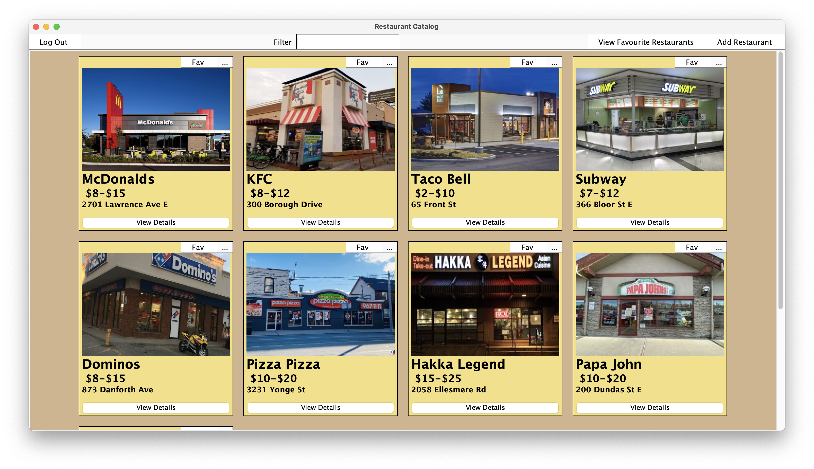

# Restaurant
Restaurant catalog software

  

## Getting Started
For **User**: go to `docs/user/userdocs.md` or click [here](https://github.com/shreypatel238/Restaurant/blob/main/docs/user/userdoc.md).
 - User docs talks about user usage of the software

For **Developer**: go to `docs/developers/developersdocs.md` or click [here](https://github.com/shreypatel238/Restaurant/blob/main/docs/developers/developersdocs.md)
 - Developer docs talks about getting started with code running and building

**NOTE: To login as Admin: User: admin, Password: pass**

## To Run
This is just a summary on how to run. Please go to `docs/developers/developersdocs.md` for the full developer documentation.
1. First we need to clone the repository to your local computer by `git clone https://github.com/shreypatel238/Restaurant.git` from your terminal in your desired location
   - If it's easier, you also go on the green code tab and download as a zip file, and unzip the file in your desired location
2. It is best to use IntelliJ, so open up IntelliJ, click on open project, then selected the folder where you clone/unzip the repository
   - If not using IntelliJ and using another editor, open the project folder
4. Once IntelliJ is loaded up, select the `HomePage.java` file, then press the green play button on the top right corner. The application will start running.
   - If not using IntelliJ, you can use the terminal. To compile, point the terminal to `src` directory and run `javac HomePage.java` then you can run the application by `java HomePage`

## To Use
This is just a summary on how to use. Please go to `docs/user/userdocs.md` for the full user guide documentation.
1. First you will need to make a account, or login. You can also login in as a guest, but you will have limited features available
2. Once logged in, you will be presented with the Home Page. From here you can browser the list of restaurant
3. View Descriptions of restaurants by clicking on the "View Details" button on a restaurants
4. If logged in as admin, you can add a restarant to the catalog, as well as update and delete restaurant from the catalog
5. If logged in, you can add restaurants to your favorite list
6. Navigate a list of restaurants with a search bar, and a filter drop down tab

## Deploy Final Product
1. Download zip file Restaurant v1.0 from the releases tab on Github or click [here](https://github.com/shreypatel238/Restaurant/releases/tag/v1.0)
   - You need to have Java installed on your computer
2. Unzip the zip file
3. Double click on the JAR file and the application will start running
   -  You also launch it from the terminal by `java -jar Restaurant.java`

## Workflow
1. `git pull` always before working
2. `git add --all` then `git commit -m <MessageHere>` then `git push -u origin main` after working
   - If it's eaiser, you can also directly update and add file here 
