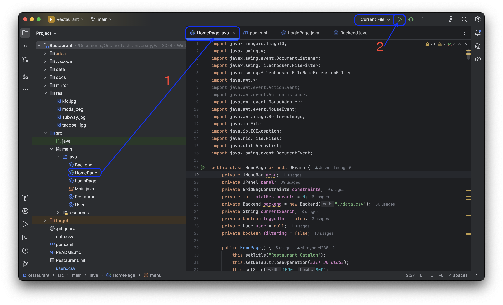
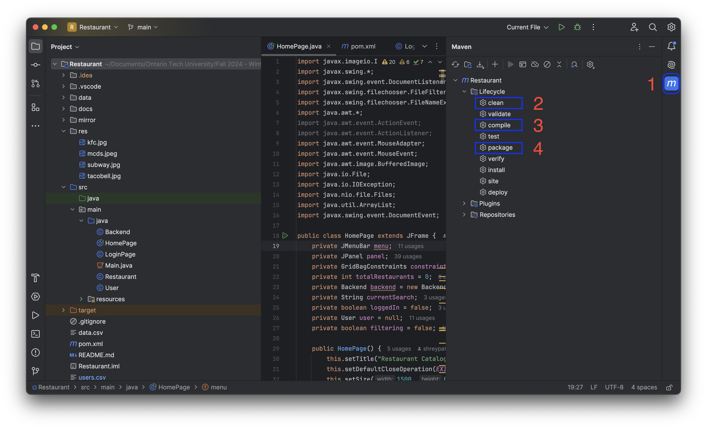

# Developer Documentation - Restaurant Catalog

This documentation provides developer the necessary information to maintain, extend, and contribute the Restaurant Catalog.

## System Architecture
The code base is split into two main part: The backend and the frontend. Our backend code handles storing data, as well as modification and additions of data. Our backend also has helper classes to help store the data. Our frontend code takes in the data from the back and shows it to the user through a GUI. Backend functions are called when the user interact with certain parts. This will be expaneded in the next section.  

The system is written in Java, using Java Swing for the GUI. JUnit is also used for our testing suites.

## Codebase Documentation
Our Code files consist of:
- `HomePage.java`
   - Front end code of the main page containing a list of restaurant, and where user can interact with the data.
   - **This where `main()` function is, and the entry point of the program. Execute this file to run the program**
- `LoginPage.java`
  - Front end code for user login and register for account
- `Backend.java`
  - Main back end code to handle data. Functions here interact with the data. Functions here are called by front end.
- `Restaurant.java`
  - Class file to represent restaurant data as objects
- `User.java`
  - Class file to represent a user as a object

**Note: The admin account is: User: admin, Password: pass**

## Build Instructions
This is Java Project, it is recomended you use IntelliJ.

### Getting Started
1. First we need to clone the repository to your local computer by `git clone https://github.com/shreypatel238/Restaurant.git` from your terminal in your desired location
   - If it's easier, you also go on the green code tab and download as a zip file, and unzip the file in your desired location
2. It is best to use IntelliJ, so open up IntelliJ, click on open project, then selected the folder where you clone/unzip the repository
   - If not using IntelliJ and using another editor, open the project folder
### Run
1. Select the `HomePage.java` file
2. Press the green play button on the top right corner. The application will start running.
   - If not using IntelliJ, you can use the terminal. To compile, point the terminal to `src` directory and run `javac HomePage.java` then you can run the application by `java HomePage`

  

### Build
1. Select the Maven tab on the right side of the screen in IntelliJ
2. Click on the `clean` command, to make sure our build is made clean environment without leftovers from previous builds
3. Click on the `compile` command, this compiles our Java code into class files
4. Click on the `package' command, this takes all the class files and makes in to a executable JAR file
5. The JAR file can found in `target/Restaurant-1.0.jar`
   - Also files like `data.csv`, `user.csv`, and the `data` folder will also be in `targer` since the executable relies on those

  

### Videos
The following two videos go over running and then building.

https://github.com/user-attachments/assets/9d696862-4f84-4e1c-b132-f33c0ad6c22f

https://github.com/user-attachments/assets/01457140-b3be-4b44-9d15-a64c232e184b

## Testing Instructions
- Automated unit tests are run with JUnit through the "Test Runner for Java" extension available in VSCode.
  - Requirements for the extension can be found here: https://marketplace.visualstudio.com/items?itemName=vscjava.vscode-java-test
- Before testing ensure build is clean
- To test, open the testing tab included with the "Test Runner for Java" extension and run tests from within