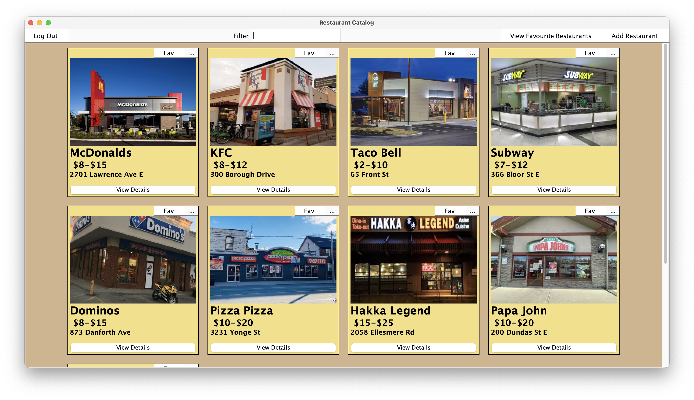
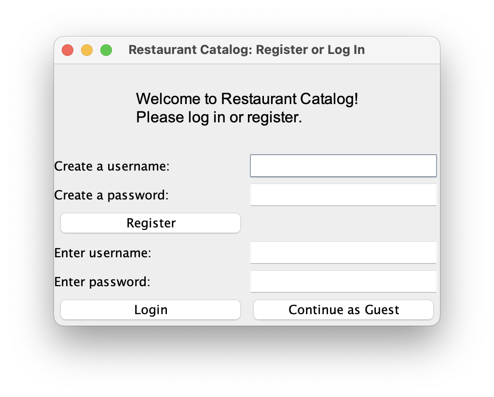
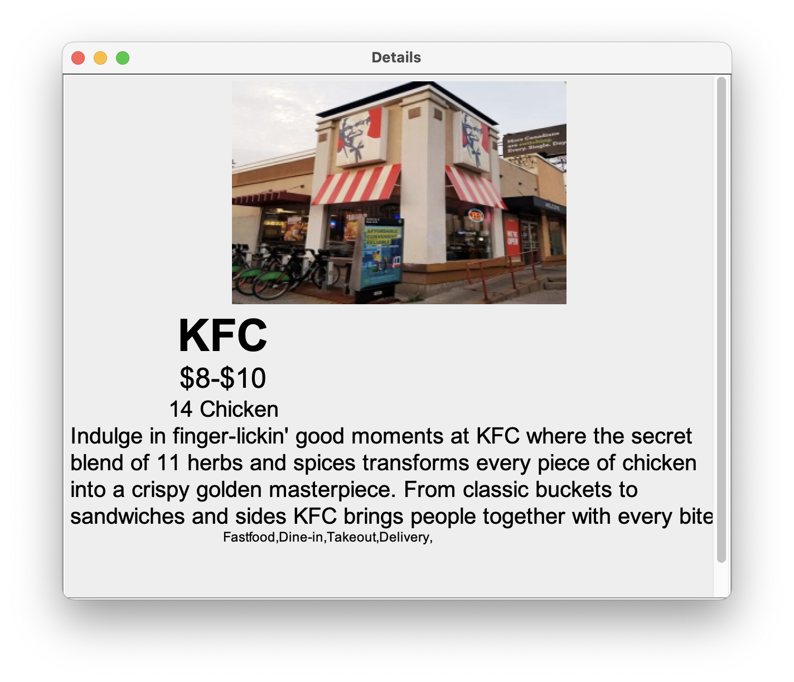
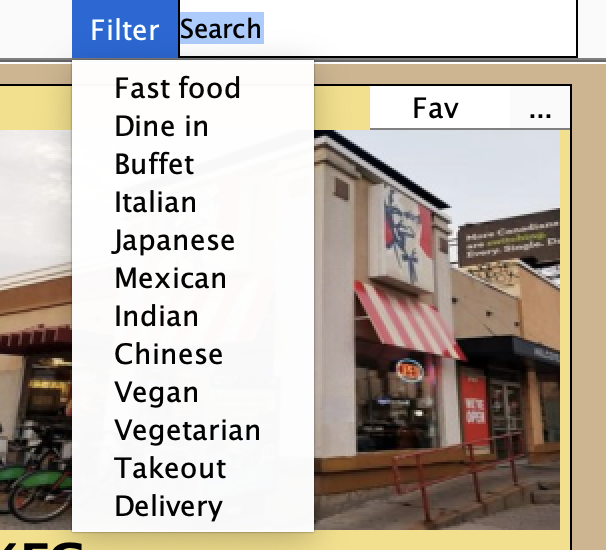
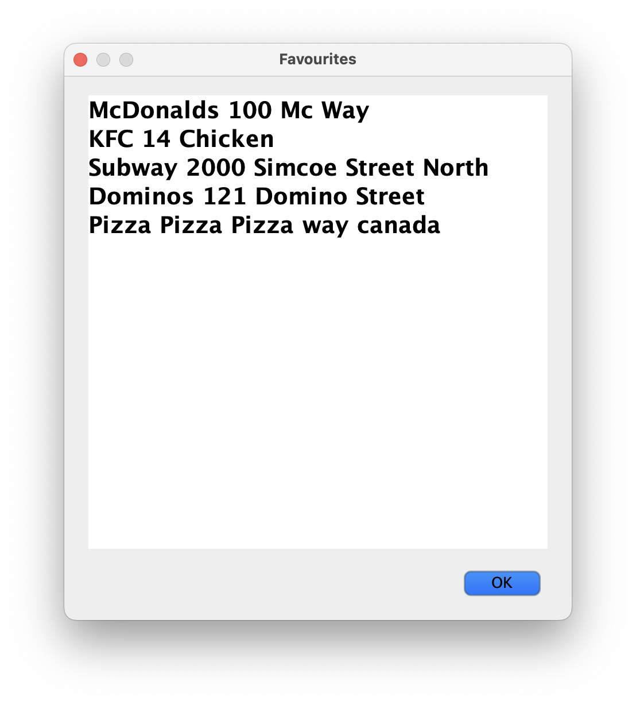
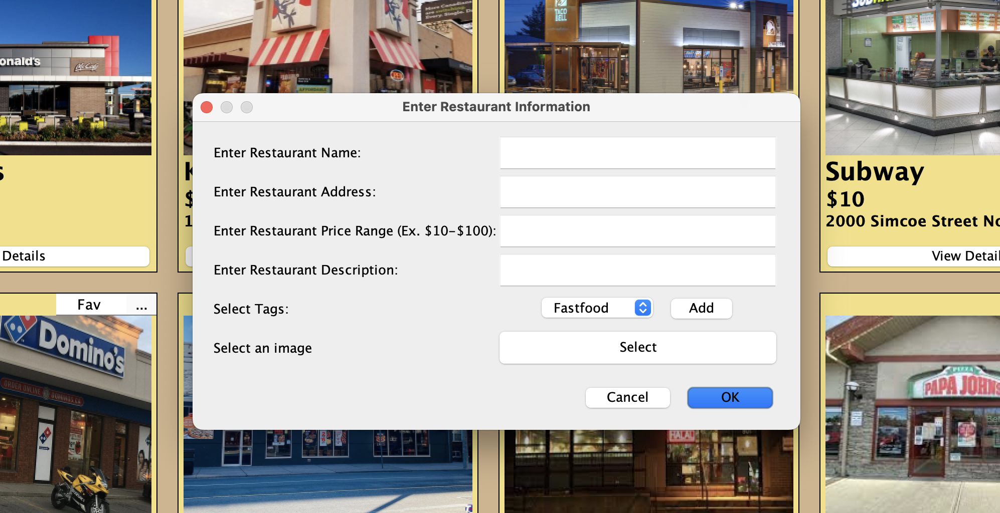

# User Documentation - Restaurant Catalog
This document is meant for the user. We will go through the usage of the application, with a video walkthrough, as well as installation, and any sort of best practices.

  
  <em>Home Page of Restaurant Catalog, login as admin</em>

## User Guide
1. When lanuching the application, you will be presented with a login and register screen. You make a account, or login. You can also login in as a guest, but you will have limited features available
   - **NOTE: To login in as Admin: User: admin, Password: pass**
   - Admin as the ablitly to add restaurants, as well is to update them, and delete them.

  
   
  <em>Login and register screen</em>

2. Once logged in, you will be presented with the Home Page. From here you can browser the list of restaurant:

  

3. View Descriptions of restaurants by clicking on the "View Details" button on a restaurants:

  

4. Easily navigate a list of restaurants with a search bar, and a filter drop down tab:

  

5. If logged in, you can add restaurants to your favorite list:

  

6. If logged in as admin, you can add a restarant to the catalog, as well as update and delete restaurant from the catalog:

  

### Demo Video

https://github.com/user-attachments/assets/53a4dbdb-2677-4e4d-9042-780f592041ae

## Installation Guide

## Best Practices

## FAQ
